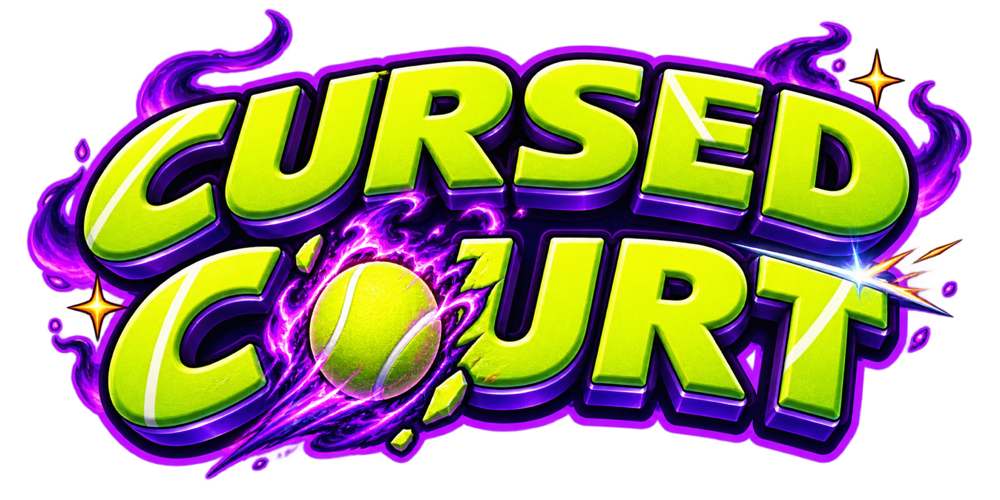

# 🎾 Cursed Court

A **Mario Tennis**-style arcade tennis game for the web — Jujutsu Kaisen vs
The Mandalorian, up to **4 players** on Xbox controllers, with fully
procedural 3D courts, stadiums, crowds, animation, and sound effects.



## Play

```bash
npm install
npm run dev      # → http://localhost:5173
npm run build    # production build in dist/
```

Plug in an Xbox controller (any Gamepad-API pad works) and press **Start** on
the title screen — the game goes fullscreen and controllers drive everything,
menus included. Keyboard fallback for dev: WASD/arrows move, **J/K/L/I** =
A/B/X/Y, **Enter** = Start.

## Features

- **13 characters**: Yuji, Megumi, Nobara, Maki, Naoya, Jogo, Mahito (JJK) ·
  Din Djarin, IG-11, Bossk, Tusken Raider, Quarren, Cad Bane (Mandalorian) —
  each with stats (power/speed/spin/reach) and a play style.
- **Mario Tennis shot system**: A topspin · B slice · Y flat · X lob ·
  A→B drop shot · hold early to **charge** · ⭐ **chance stars** on floaty
  balls → swing from the star for a screen-shaking **Star Shot** · timed
  toss for **power serves**.
- **Real tennis scoring** — 15/30/40, deuce/advantage, serve rotation,
  singles & doubles (AI fills empty slots; 1–4 humans).
- **3 courts**: Shibuya Hard Court, Nevarro Clay, Cursed Night — each with its
  own bounce/speed feel and procedural stadium, sky, and crowd.
- **Procedural everything**: court, net, stands, animated crowd, racquets,
  VFX, and all sound effects are generated in code (WebAudio synthesis); the
  character GLBs are driven by a shared procedural tennis-animation system
  (no baked animations).
- Music: *Cursed Court Rally 1* (menus), *Rally 2* → random mix (gameplay),
  *Cursed Court Short* (victory).
- Bottom-right icon buttons: fullscreen, instructions (Xbox controller
  diagram), settings (volumes, rumble, crowd density).

## Project docs

- `PLAN.md` — architecture & design plan
- `PROGRESS.md` — build progress tracker
- `image-requests.md` / `image-requests-history.md` — generated-art pipeline
